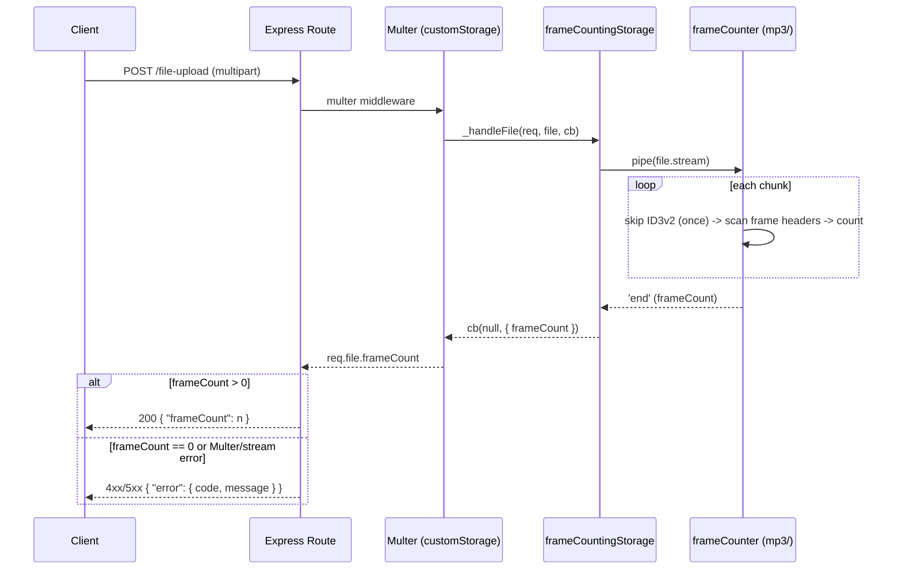

# MP3 Frame-Counting Upload API

## Summary

Build a TypeScript/Node/Express service exposing `POST /file-upload`, which accepts a streamed MP3 upload via a custom Multer storage engine and counts MPEG-1 Audio Layer III frames incrementally as bytes arrive — using hand-written ID3v2/frame-header parsing (no MP3-parsing npm package), bounded memory regardless of file size, a defined `{ error: { code, message } }` contract for every failure mode, and Jest/ts-jest coverage down to byte-level edge cases.

---

## Problem Frame

This is a take-home technical assessment (Foundation Health, `challenge-description.txt` / `assignment-description.pdf`) evaluated on correctness, code quality, error handling, scalability, and git approach. The repo is currently empty (no `package.json`, no git history) aside from the spec files and a provided `sample (2).mp3` fixture, so this plan covers the full build from scratch.

---

## Requirements

- R1. Solution is written in TypeScript.
- R2. Application hosts `POST /file-upload` accepting an MP3 file upload.
- R3. Frame counting logic for MPEG-1 Audio Layer III is hand-written — no npm package may parse the MP3 frame data itself (generic utilities/HTTP frameworks are fine).
- R4. Response is JSON `{ "frameCount": <number> }` with correct headers (`Content-Type: application/json`).
- R5. Errors are handled gracefully with useful messages (explicit evaluation criterion; spec defines no error shape).
- R6. Solution is scalable and performant for large files (explicit evaluation criterion).
- R7. Solution includes standardized tooling — formatting, linting, testing (explicit evaluation criterion).
- R8. Submission is a git repository with clear run/test instructions and a testing example (submission requirement).

Non-MPEG-1-Layer-III formats are explicitly out of scope for counting per the spec ("candidates are encouraged not to spend time on this") — see Scope Boundaries.

---

## Scope Boundaries

- Counting frames for any format other than MPEG-1 Audio Layer III (explicitly out of scope per spec; such frames are treated as "not countable," not crashed on).
- Extracting or exposing ID3 metadata (title, artist, etc.) beyond the byte-length needed to skip the tag.
- Authentication, authorization, rate limiting, or multi-tenant concerns.
- Persisting uploaded files to disk or any datastore — files are processed transiently in memory (bounded, streaming) and discarded.
- A frontend/UI — this is an API-only service.

### Deferred to Follow-Up Work

- CI pipeline (e.g., GitHub Actions running lint/test on push): noted in the README as a "with more time" improvement per the assignment's own tip, not built now.
- Automated fuzz/property-based testing of the frame-header parser: noted as a future improvement; U2/U3 test scenarios below cover the specific edge cases found during planning by hand instead.
- Support for MPEG "free" bitrate (bitrate index `0000`): real-world rarity and absence from the sample fixture make this low-value for the assessment window; treated as an unsupported/skipped edge case (see Key Technical Decisions) with a note in the README.

---

## Context & Research

### Relevant Code and Patterns

None — the repository is greenfield (confirmed via `ls`/`git status`: no `package.json`, no `.git`, only the spec files and the sample fixture). No local patterns to follow; conventions are established fresh in U1/U2.

### External References

- MPEG audio frame header bit layout, MPEG-1 Layer III bitrate table (32–320 kbps), sample-rate table (44100/48000/32000 Hz), and the Layer III frame-size formula `floor(144 * bitrate_bps / sampleRate_Hz) + padding` — cross-referenced from the mp3-tech.org-derived header reference (`datavoyage.com/mpgscript/mpeghdr.htm`) and Teslabs' `mp3_structure2.pdf`.
- ID3v2.4.0 structure spec (id3.org / `github.com/id3/ID3v2.4`) — 10-byte header, synchsafe 32-bit size field (bytes 6–9, 7 usable bits/byte), optional footer flag adding 10 more bytes.
- ID3v1 (128-byte `"TAG"` trailer) and APEv2 (`"APETAGEX"` footer) trailing-tag conventions (Wikipedia "ID3"; hydrogenaudio wiki APEv2 spec) — relevant so trailing non-audio bytes aren't misread as corrupt frames.
- Xing/Info and VBRI VBR header conventions (LAME/Fraunhofer "MP3 Info Tag" spec) — the tag frame sits inside the first audio frame's payload at a channel-mode-dependent offset and carries the encoder's own declared frame count, which by convention excludes itself (see Fixture ground-truth below, where this was verified directly rather than assumed).
- **Fixture ground-truth, verified directly against `sample (2).mp3` during planning:**
  - `xxd` on the file head shows an ID3v2 header `49 44 33 04 00 00 00 00 00 22` → tag size (synchsafe) decodes to 34, so total header+tag = 44 bytes; byte 44 (`0xFF 0xFB`) is confirmed to be a valid MPEG-1 Layer III frame sync (version bits `11`, layer bits `01`), validating the ID3v2-skip approach against the real file rather than only in theory.
  - `xxd` on the file tail shows the file ends with a long run of `0xAA` bytes, not a `"TAG"` or `"APETAGEX"` marker and not a clean frame boundary — confirms the streaming parser must terminate cleanly on trailing non-frame bytes rather than assuming the file ends exactly on a frame boundary.
  - `xxd -s 44 -l 64` shows the first frame header (`FF FB 50 00`) followed by joint-stereo side info, then the ASCII magic `Xing` at byte offset 80 (44 [ID3v2 skip] + 4 [frame header] + 32 [side-info block for MPEG-1 stereo/joint-stereo]) — confirming this file's first audio frame is a Xing/LAME VBR header tag, not real audio data. (Verified programmatically via `data.find(b'Xing')`, not just by eye against the hex dump.)
  - The Xing tag's flags field (`00 00 00 0f`) declares all four optional fields present; the next 4 bytes (`00 00 17 c9`) are the tag's self-declared frame count, decoding to **6089**.
  - `ffprobe -count_frames -select_streams a:0` on the fixture reports **6089** frames — this is a genuine independent demux count.
  - `mediainfo --Full` on the fixture (installed locally via Homebrew for this cross-check, per the spec's own tip) reports `Frame count: 6089` — but this is **not** an independent measurement: patching a copy of the fixture's Xing-declared frame-count field from 6089 to 1 and re-running both tools showed `ffprobe` still reporting ~6088 (its own demux, barely moved) while `mediainfo`'s reported count changed to exactly 1. `mediainfo` displays the file's self-declared Xing value rather than computing anything itself.
  - **The real evidence is two facts, not three**: an independent `ffprobe` demux count, and the file's own Xing-tag-declared count (which `mediainfo` merely echoes) — both agree on 6089 only if the Xing tag's own frame is excluded from the count (a raw walk counting every frame including the Xing frame would total 6090). This still resolves the counting convention with real evidence (see Key Technical Decisions) rather than leaving it as an assumption — it's just not three-way corroboration.
  - Local toolchain used for verification: Node v24.14.0, npm 11.9.0, `ffprobe`/`ffmpeg`, and `mediainfo` (all available).

---

## Key Technical Decisions

- **Express + multer with a custom Multer `StorageEngine`** (not default disk/memory storage): Rationale — default Multer storage buffers the entire file to memory or disk before route-handler code runs, which would defeat the streaming/scalability goal. Multer's `StorageEngine._handleFile(req, file, cb)` hands back the raw upload `Readable` stream during the request, which the custom engine pipes directly into the frame counter — this is what makes "stream + incremental parse" real at the HTTP layer while still using Express/Multer for request plumbing (both allowed as generic HTTP/utility packages). **Alternative considered:** buffering the whole upload via Multer's built-in memory storage (capped by `limits.fileSize`) and parsing it in one pass afterward — simpler to implement, but rejected because scalability/large-file handling is an explicit, named evaluation criterion, and the custom-storage approach keeps memory bounded independent of the configured size cap rather than merely capping it.
- **Streaming, chunk-boundary-safe frame counter**: a bounded carry-over `Buffer` persists between chunks so a frame header or frame body split across two `data` events is still parsed correctly, keeping memory O(1) relative to file size. Sized to comfortably exceed the largest possible single MPEG-1 Layer III frame — per the frame-size formula below, the worst case is the *highest* bitrate paired with the *lowest* sample rate (320 kbps @ 32 kHz → `floor(144 * 320000 / 32000) + 1` = 1441 bytes), so the buffer carries headroom above that (e.g., ~3000 bytes) rather than the ~2881 bytes originally (and incorrectly) stated here as tied to the *lowest* bitrate/sample-rate combination.
- **Frame validation beyond the 11-bit sync**: a match is only counted as a real frame if MPEG version bits are `11` (MPEG-1), layer bits are `01` (Layer III), bitrate index is not `1111` (bad) or `0000` (free, unsupported), and sample-rate index is not `11` (reserved). Anything else advances the scan by one byte and resyncs rather than throwing — reduces false-positive frame detection on non-MP3/corrupt input.
- **Zero valid frames found → `422 UNPARSEABLE_MP3`, not `200 { frameCount: 0 }`**: a zero count is indistinguishable from "this isn't actually an MP3 file," and the spec explicitly cares about error handling being useful — a distinct error is more informative than a silently misleading success response.
- **Error contract**: `{ "error": { "code": string, "message": string } }`, since the spec defines the success shape but is silent on errors. Codes map to status: `NO_FILE_PROVIDED`/`INVALID_MULTIPART` → 400, `FILE_TOO_LARGE` → 413, `UNPARSEABLE_MP3` → 422, `INTERNAL_ERROR` → 500 (generic message only, no stack traces leaked).
- **Multer `limits` pin `files: 1` and a low `fields`/`parts` count**, alongside `fileSize`: the endpoint expects exactly one file field and nothing else, so bounding field/part counts (not just byte size) closes a request-shape resource-exhaustion path a size limit alone doesn't cover.
- **Multer's core middleware (not the storage engine) already handles stream errors and size-limit truncation**: verified directly against the installed `multer@2.2.0` source — Busboy's file stream gets `'error'` and `'limit'` listeners attached by Multer's core *before* any storage engine's `_handleFile` runs, and once an abort is in progress Multer discards whatever the storage engine's own callback later returns. The custom storage engine does not need to duplicate this detection (an earlier version of this plan assumed otherwise); it does need to implement the required `_removeFile` method alongside `_handleFile` (Multer calls it unconditionally during abort cleanup), and must not let its own `frameCounter`/`vbrTag` parsing throw uncaught inside the stream's data handler — both covered in U4's Approach.
- **Xing/Info/VBRI header frames are excluded from the count, not counted**: verified directly against the sample fixture — `ffprobe`'s independent demux count and the file's own Xing tag's self-declared frame-count field both agree on 6089 (`mediainfo` was confirmed, by deliberately corrupting the Xing tag's declared value, to simply echo that field rather than compute anything independently), and that figure only matches a sync-walk that skips incrementing `frameCount` for the Xing/Info/VBRI tag frame itself (a raw walk counting every frame including the tag would total 6090). The parser detects this tag by checking for the `"Xing"`/`"Info"`/`"VBRI"` ASCII magic at the standard channel-mode-dependent offset within the first successfully-parsed audio frame's payload, and — only for that one frame — advances past it (using its own computed frame size) without incrementing the count.
- **Test stack**: Jest + ts-jest for unit/integration tests, `supertest` for HTTP-level route tests — both are generic testing utilities, not MP3 parsers, so allowed under R3.

---

## Open Questions

### Resolved During Planning

- HTTP/upload stack: Express + multer with a custom `StorageEngine` (see Key Technical Decisions).
- Parsing strategy: stream + incremental parse, not buffer-then-parse.
- Test framework: Jest + ts-jest.
- Error response shape and status-code mapping: defined above.
- Zero-frame behavior: `422`, not `200` with `frameCount: 0`.
- Xing/Info/VBRI counting convention: excluded from the count, confirmed by an independent `ffprobe` demux count agreeing with the fixture's own Xing-tag-declared value at 6089 (`mediainfo` echoes the same Xing-declared value rather than adding a third independent data point — see Key Technical Decisions and Context & Research).
- Carry-over buffer worst-case sizing: corrected to the highest-bitrate/lowest-sample-rate combination (1441 bytes), not the lowest/lowest combination originally (and incorrectly) stated.

### Deferred to Implementation

- Exact max-upload-size limit value for Multer's `limits.fileSize` — a reasonable default (e.g., 100–500 MB) should be chosen during implementation; the exact number is a judgment call, not a product requirement.
- Behavior for a file that contains a mix of matching and non-matching-format frames mid-stream (e.g., MPEG-1 L3 audio followed by unrelated non-frame data) beyond "skip non-matching, keep scanning" — extremely unlikely given the sample fixture and spec scope; revisit only if implementation testing surfaces a real case.
- Whether to add forward cross-validation (confirming a second sync exists at `offset + frameSize` before accepting a frame) — noted in Risks as a mitigation to add if false-positive syncs show up during testing against adversarial/non-MP3 input, not required upfront.

---

## Output Structure

    .
    ├── package.json
    ├── tsconfig.json
    ├── eslint.config.js
    ├── .prettierrc
    ├── jest.config.ts
    ├── .gitignore
    ├── README.md
    ├── src/
    │   ├── server.ts
    │   ├── app.ts
    │   ├── errors.ts
    │   ├── routes/
    │   │   └── fileUpload.ts
    │   ├── upload/
    │   │   └── frameCountingStorage.ts
    │   ├── mp3/
    │   │   ├── id3.ts
    │   │   ├── frameHeader.ts
    │   │   ├── vbrTag.ts
    │   │   └── frameCounter.ts
    │   └── middleware/
    │       └── errorHandler.ts
    └── test/
        ├── fixtures/
        │   └── sample.mp3
        ├── mp3/
        │   ├── id3.test.ts
        │   ├── frameHeader.test.ts
        │   ├── vbrTag.test.ts
        │   └── frameCounter.test.ts
        └── routes/
            └── fileUpload.test.ts

---

## High-Level Technical Design

> *This illustrates the intended approach and is directional guidance for review, not implementation specification. The implementing agent should treat it as context, not code to reproduce.*



---

## Implementation Units

### U1. Project Scaffolding & Tooling

**Goal:** Initialize the TypeScript/Node project with build, lint, format, and test tooling so every later unit lands on a working, checkable foundation.

**Requirements:** R1, R7, R8

**Dependencies:** None

**Files:**
- Create: `package.json`, `tsconfig.json`, `eslint.config.js`, `.prettierrc`, `jest.config.ts`, `.gitignore`, `README.md` (skeleton)

**Approach:**
- `git init` the repo; this unit should land as the first commit so subsequent units land as separate, reviewable commits (per the "used Git effectively" evaluation criterion).
- Add `express`, `multer`, and their `@types` as dependencies; `typescript`, `ts-node`/`tsx` (dev server), `jest`, `ts-jest`, `@types/jest`, `supertest`, `@types/supertest`, `eslint` + `typescript-eslint`, and `prettier` as devDependencies.
- `npm` scripts: `build`, `start`, `dev`, `lint`, `format`, `test`.
- Pin `engines.node` to the version the solution is developed/verified against.

**Test scenarios:**
- Test expectation: none -- scaffolding only, no behavior to test yet.

**Verification:**
- `npm run lint`, `npm run build`, and `npm test` all run cleanly against the skeleton (zero tests is an acceptable result at this stage).

---

### U2. Domain Layer — ID3v2 Skip & Frame Header Parsing

**Goal:** Implement the pure, stateless building blocks: computing how many leading bytes to skip past an ID3v2 tag, and parsing/validating a single 4-byte MPEG frame header — with no HTTP or streaming concerns.

**Requirements:** R3

**Dependencies:** U1

**Files:**
- Create: `src/mp3/id3.ts`, `src/mp3/frameHeader.ts`, `src/mp3/vbrTag.ts`
- Test: `test/mp3/id3.test.ts`, `test/mp3/frameHeader.test.ts`, `test/mp3/vbrTag.test.ts`

**Approach:**
- `id3.ts`: given the leading bytes of a file, detect the `"ID3"` magic, decode the synchsafe 32-bit size (bytes 6–9, 7 usable bits per byte), add 10 more bytes if the footer-present flag is set, and return the total skip length (0 if no ID3v2 tag is present).
- `frameHeader.ts`: given a 4-byte window, attempt to parse a valid MPEG-1 Layer III header — validate the 11-bit sync, require MPEG version bits `11` and layer bits `01`, reject bitrate index `1111`/`0000` and sample-rate index `11`, look up bitrate/sample-rate from tables, and compute frame size via `floor(144 * bitrateBps / sampleRateHz) + padding`. Also extracts and exposes the `protection_bit` (byte 1, bit 0) on the parsed header — when 0, a 2-byte CRC field follows the header before the side info, shifting every downstream payload offset by +2 bytes. Distinguishes three outcomes rather than a binary valid/invalid: a fully valid header, "not a valid frame here" (enough bytes but the fields don't check out), and "insufficient data" (fewer than 4 bytes available) — callers use this distinction to know whether to resync at the next byte or wait for more data.
- `vbrTag.ts`: given a parsed frame header (including its `protection_bit`) plus a window into that frame's payload, detect whether the frame is a Xing/Info/VBRI VBR-header tag rather than real audio — check for the `"Xing"`/`"Info"` ASCII magic at the side-info-dependent offset (32 bytes after the header for MPEG-1 stereo/joint-stereo, 17 bytes for MPEG-1 mono) or `"VBRI"` at a fixed 32-byte offset, adding 2 bytes to whichever offset applies when `protection_bit` indicates a CRC is present. Mirrors `frameHeader.ts`'s three-outcome pattern (`TagFound | NotATag | InsufficientData`) rather than assuming the full check window is always available — the caller (U3) only invokes it once enough bytes are buffered. Used by U3 to decide whether to skip incrementing `frameCount` for the first audio frame.

**Technical design:** *(directional, not implementation-ready)*

```
parseFrameHeader(bytes: 4-byte window):
  if not (bytes[0] == 0xFF and (bytes[1] & 0xE0) == 0xE0): return NOT_A_FRAME
  version   = bits(bytes[1], 4..3)   // must be 11 (MPEG-1)
  layer     = bits(bytes[1], 2..1)   // must be 01 (Layer III)
  bitrateIx = bits(bytes[2], 7..4)   // reject 0000, 1111
  srateIx   = bits(bytes[2], 3..2)   // reject 11
  padding   = bit(bytes[2], 1)
  if version != MPEG1 or layer != LAYER3: return NOT_A_FRAME
  if bitrateIx in {BAD, FREE} or srateIx == RESERVED: return NOT_A_FRAME
  frameSize = floor(144 * BITRATE[bitrateIx] / SAMPLERATE[srateIx]) + padding
  return { frameSize, bitrateIx, srateIx, padding }
```

**Patterns to follow:** none yet — first domain code in the repo; establish a discriminated-union return type (`ValidHeader | NotAFrame | InsufficientData`) in `frameHeader.ts`, and mirror the same three-outcome shape (`TagFound | NotATag | InsufficientData`) in `vbrTag.ts` — both modules face the same "not enough bytes yet" problem and should solve it the same way.

**Test scenarios:**
- Happy path: bytes `FF FB 50 00` (the real bytes found immediately after the sample fixture's ID3v2 tag) parse to the correct bitrate, sample rate, padding, and frame size.
- Happy path: ID3v2 header bytes `49 44 33 04 00 00 00 00 00 22` (the sample fixture's actual header) decode to skip-length 44.
- Happy path: input with no `"ID3"` magic at offset 0 returns skip-length 0.
- Edge case: ID3v2 footer-present flag set adds 10 bytes to the computed skip length.
- Edge case: bitrate index `0000` (free) and `1111` (bad) are both rejected.
- Edge case: sample-rate index `11` (reserved) is rejected.
- Edge case: MPEG version bits for MPEG-2/2.5, or layer bits for Layer I/II, are rejected (out-of-scope formats not counted).
- Edge case: padding bit set vs. unset changes the computed frame size by exactly 1 byte, all else equal.
- Error path: a window shorter than 4 bytes does not throw — returns an "insufficient data" signal distinct from "not a valid frame."
- Happy path (`vbrTag.ts`): the real fixture's first post-ID3v2 frame (header `FF FB 50 00` at file offset 44, joint stereo) contains `"Xing"` at payload offset 32 — i.e., 32 bytes after the 4-byte frame header, file offset 80 — detected as a VBR header tag frame.
- Edge case (`vbrTag.ts`): a frame payload containing `"Info"` (LAME's CBR variant of the tag) at the same offset is also detected as a tag frame.
- Edge case (`vbrTag.ts`): a synthetic frame payload containing `"VBRI"` at the fixed 32-byte offset is detected as a tag frame — the real fixture only contains a Xing tag, so this case is necessarily synthetic rather than fixture-derived.
- Edge case (`vbrTag.ts`): a mono-channel frame checks for the tag magic at offset 17, not 32 (side-info size differs by channel mode).
- Edge case (`vbrTag.ts`): a synthetic frame with `protection_bit` indicating CRC-present shifts the expected tag-magic offset by +2 bytes (e.g., 34 instead of 32 for stereo) — the real fixture has no CRC, so this case is also synthetic.
- Edge case (`vbrTag.ts`): a window shorter than the required check offset does not throw — returns an "insufficient data" signal, mirroring `frameHeader.ts`'s error path.
- Edge case (`vbrTag.ts`): a frame payload with no recognizable magic at any expected offset is *not* flagged as a tag frame, even if it coincidentally contains similar bytes elsewhere in the payload.

**Verification:**
- Both modules pass unit tests in isolation with no I/O or streaming involved.

---

### U3. Streaming Frame Counter

**Goal:** Compose U2's building blocks into a stateful counter that consumes Buffer chunks as they arrive, correctly handles frame/header data split across chunk boundaries, and terminates cleanly at EOF without requiring the file to end on a frame boundary.

**Requirements:** R3, R6

**Dependencies:** U2

**Files:**
- Create: `src/mp3/frameCounter.ts`
- Test: `test/mp3/frameCounter.test.ts`

**Approach:**
- State machine: `SKIP_ID3 → SCAN_FRAMES → DONE`. Holds a bounded carry-over `Buffer` (see Key Technical Decisions for sizing), the current byte offset, a `hasSeenFirstAudioFrame` flag, and a running `frameCount`.
- `SKIP_ID3` decrements a remaining-skip counter as chunks arrive and discards the skipped bytes without buffering them — it does not concatenate ID3v2 tag bytes into the carry-over buffer, so a large embedded-cover-art ID3v2 tag (which can legally run into the hundreds of KB) is skipped in O(1) memory just like the audio-scanning phase.
- On each chunk: concatenate with carry-over, scan forward from the current position using `frameHeader.ts`; on a valid header, and only once enough bytes are buffered for `vbrTag.ts`'s full check window (waiting for more chunks otherwise, per its "insufficient data" signal), use `vbrTag.ts` (U2) to check whether this is the first audio frame and whether it's a Xing/Info/VBRI tag frame — if so, advance past it without incrementing `frameCount`; otherwise advance by the computed frame size and increment `frameCount`. On invalid or insufficient data near the end of the current buffer, retain the unconsumed tail as carry-over for the next chunk.
- On stream end: if the remaining carry-over doesn't form a valid frame (trailing padding, an ID3v1/APEv2 trailer, or leftover partial bytes), simply stop — this is not an error on its own; only "zero frames found across the whole stream" is treated as an error, and that decision belongs to the caller (U4), not this module.
- Defensively cap the carry-over buffer size so adversarial/non-MP3 input full of near-miss sync bytes can't cause unbounded memory growth.

**Technical design:** *(directional)* — see Approach's state-machine description; no additional pseudo-code needed beyond U2's parser sketch, which this unit calls repeatedly against a sliding window.

**Patterns to follow:** `src/mp3/frameHeader.ts`, `src/mp3/id3.ts` (U2)

**Test scenarios:**
- Happy path: feeding the entire sample fixture as a single chunk yields exactly **6089**, matching the `ffprobe` demux count and the fixture's own Xing-tag-declared value (see Context & Research) — asserted as an exact value, not a range.
- Happy path: the fixture's first audio frame (the Xing tag frame) is walked past correctly but does not increment the count — verifiable by asserting the total is 6089, not 6090.
- Happy path: feeding the identical fixture split into many small chunks (e.g., 1KB at a time) yields the same frame count as the single-chunk case, proving chunk-boundary handling is correct.
- Edge case: a synthetic buffer with a valid frame header's 4 bytes split at byte offset 1, 2, and 3 across two chunks (three separate cases) still detects the frame in each case.
- Edge case: an ID3v2 tag itself split across the first two chunks is still skipped correctly, and a synthetic multi-chunk ID3v2 tag several times larger than one chunk is skipped without the carry-over buffer growing to hold it.
- Edge case: a file containing only an ID3v2 tag and no audio data at all → frame count 0.
- Edge case: trailing non-frame bytes after the last valid frame (mirroring the sample fixture's trailing `0xAA` run) do not throw and are not miscounted as a frame.
- Edge case: a synthetic buffer containing near-miss sync bytes (bytes that pass the raw 11-bit sync check but fail field validation, deliberately embedded among otherwise-random data) does not produce a false-positive frame count — this is the scenario the false-positive-sync risk (see Risks & Dependencies) depends on being exercisable, so forward cross-validation can be evaluated on real evidence rather than deferred indefinitely.
- Error path: non-MP3 binary content (random bytes, or a small PNG/JPEG header) that never produces a valid sync+header combination → frame count 0, no throw, no infinite loop.
- Integration: piping a real `fs.createReadStream` over the fixture through the counter produces the same count as the direct-buffer test, proving the streaming interface itself — not just the counting logic — is correct.

**Verification:**
- `frameCounter` produces identical, correct counts regardless of how the same underlying bytes are chunked.

---

### U4. HTTP Layer — Upload Route, Custom Storage Engine, Error Handling

**Goal:** Wire the streaming frame counter into `POST /file-upload` via a custom Multer storage engine so counting happens during upload rather than after full buffering, and implement the error taxonomy so every failure mode returns a clear JSON error instead of a crash or a generic Express HTML error page.

**Requirements:** R2, R4, R5, R6

**Dependencies:** U1, U3

**Files:**
- Create: `src/upload/frameCountingStorage.ts`, `src/routes/fileUpload.ts`, `src/errors.ts`, `src/middleware/errorHandler.ts`, `src/app.ts`, `src/server.ts`
- Test: `test/routes/fileUpload.test.ts`

**Approach:**
- `frameCountingStorage.ts` implements Multer's `StorageEngine` interface: `_handleFile(req, file, cb)` receives the file's `Readable` stream directly from Multer/Busboy before any buffering; pipe it through `frameCounter` (U3) and, on stream `'end'`, call back with `{ frameCount }` as file metadata — no bytes are written to disk or fully buffered in memory. Stream-level errors and `limits.fileSize` truncation are already handled by Multer's own core middleware before `_handleFile` is even invoked (verified against the installed `multer@2.2.0` source), so `frameCountingStorage.ts` does not need to duplicate that detection — an earlier version of this plan assumed it did.
- `frameCountingStorage.ts` also implements `_removeFile(req, file, callback)` — required by Multer's `StorageEngine` interface (confirmed against the actual source: called unconditionally during abort cleanup) — as a no-op (`callback(null)`), since nothing is ever persisted that needs cleanup.
- `frameCountingStorage.ts` wraps its per-chunk `frameCounter`/`vbrTag` processing in try/catch and forwards any thrown error to `cb(error)` — this hand-rolled parsing logic (not Multer's own machinery) is the code most likely to throw on adversarial or malformed input, and an uncaught throw inside a stream data handler can crash the whole process rather than just failing one request.
- `fileUpload.ts`: Multer middleware configured with the custom storage and a documented single-file field name, with `limits` pinning `fileSize`, `files: 1`, and a low `fields`/`parts` count (see Key Technical Decisions); on success, respond `res.json({ frameCount: req.file.frameCount })`. Multer/stream errors are passed to Express's error-handling middleware rather than handled ad hoc in the route.
- `errors.ts` defines a small typed error hierarchy (`AppError` base with `statusCode`/`code`, plus specific subclasses) so the error middleware maps any thrown/forwarded error to the `{ error: { code, message } }` contract deterministically.
- `errorHandler.ts` is the single Express error-handling middleware: maps Multer errors (`LIMIT_UNEXPECTED_FILE`, `LIMIT_FILE_SIZE`, etc. — including the size-limit truncation case, which surfaces here as a standard `MulterError` rather than needing custom detection upstream), the app's own `AppError` subclasses, and any other error (generic 500, no internal detail leaked).
- Zero frames found is raised as `UnparseableMp3Error` (422) after the storage engine finishes, per the Key Technical Decision — not silently returned as `frameCount: 0`.

**Technical design:** see High-Level Technical Design sequence diagram above.

**Patterns to follow:** `src/mp3/frameCounter.ts` (U3)

**Test scenarios (via `supertest` against the real Express app):**
- Happy path: uploading the real sample fixture returns `200` and `{ "frameCount": 6089 }` with `Content-Type: application/json`.
- Edge case: no file field in the multipart body → `400` with a `NO_FILE_PROVIDED`-shaped error body.
- Edge case: wrong field name for the file → `400`, same shape, not a generic 500.
- Edge case: non-multipart `Content-Type` (e.g., a raw JSON body) posted to the endpoint → `400`, not an uncaught exception.
- Edge case: zero-byte file uploaded under the correct field → `422` (unparseable), distinct from the "no file at all" `400` case.
- Edge case: multiple files uploaded under the same field → deterministic handling (reject `400`, or process only the first — either is acceptable, but the chosen behavior is covered by this test).
- Error path: non-MP3 file (renamed JPEG or plain text with a `.mp3` name) → `422` with a clear "not a parseable MP3" message, not a crash and not a false `frameCount`.
- Error path: uploaded file exceeding the configured size limit is truncated by Busboy, not rejected outright → asserts `413` with a clear message, not a `200` with a wrong (truncated) `frameCount`.
- Error path: client aborts the connection mid-upload (destroy the request socket partway through) → the server does not crash and does not hang; either a graceful non-response (client is gone) or, if detected before disconnect, an appropriate error response.
- Error path: simulated internal failure (e.g., forcing the counter to throw) → `500` with a generic message, no stack trace or internals leaked.
- Integration: response headers are asserted explicitly (`Content-Type: application/json...`) since the spec calls out "correct response headers" by name.

**Verification:**
- Every request-level and content-level edge case identified during planning returns a well-formed JSON response with an appropriate status code — none produce an unhandled exception, a hung request, or Express's default HTML error page.

---

### U5. Fixtures, Cross-Verification & Documentation

**Goal:** Make the solution easy to run, test, and independently verify, satisfying the submission and "structured approach" evaluation criteria.

**Requirements:** R7, R8

**Dependencies:** U1, U2, U3, U4

**Files:**
- Create: `test/fixtures/sample.mp3` (copy of the provided sample), `README.md` (finalized)

**Approach:**
- Copy the provided sample file into the repo as a committed test fixture so `npm test` is self-contained and reproducible without the original submission bundle.
- README documents: setup (`npm install`), running the server (`npm run dev` / `npm start`), running tests (`npm test`), and a concrete manual test example (e.g., `curl -F "file=@test/fixtures/sample.mp3" http://localhost:3000/file-upload`) per the submission requirement for "an example of how to test the application."
- README includes a short "how correctness was verified" note referencing the cross-check performed during planning (`ffprobe -count_frames` independently agrees with the fixture's own Xing tag self-declared frame count at 6089; `mediainfo --Full` was confirmed to echo that same Xing-declared value rather than compute it independently), and states the parser's counting convention explicitly (Xing/Info/VBRI tag frames are walked past but excluded from the count) so the rationale is documented, not just the number.
- README includes a brief "what I'd do with more time" section per the assignment's own tip (e.g., CI pipeline, fuzz/property-based testing of the header parser, "free" bitrate support, large-synthetic-file benchmarking).

**Test scenarios:**
- Test expectation: none -- documentation and fixture-copying only, no new behavior.

**Verification:**
- A reviewer following only the README, starting from a fresh clone, can install, run, and successfully test the endpoint against the provided sample without additional context.

---

## System-Wide Impact

- **Interaction graph:** Single route (`POST /file-upload`) on a standalone Express app; no other routes, services, or persistence layers exist to be affected.
- **Error propagation:** All errors (Multer errors, domain errors from the frame counter, unexpected exceptions) funnel through one Express error-handling middleware (U4) into the single `{ error: { code, message } }` contract — no error path bypasses it.
- **State lifecycle risks:** No persisted state; each request's carry-over buffer and frame count are scoped to that request's stream and discarded on completion or error, so there's no cross-request leakage or cleanup concern.

---

## Risks & Dependencies

| Risk | Mitigation |
|------|------------|
| False-positive frame sync matches on random bytes in non-MP3 uploads produce a nonzero-but-wrong `frameCount` | Full header field validation beyond the sync bits (U2); a dedicated near-miss-sync test scenario (U3) makes the failure mode observable during development rather than purely theoretical, so the decision to add forward cross-validation (confirm a second sync at `offset + frameSize`) is evidence-based |
| Multer's default storage would defeat the streaming/memory-scalability goal | Custom `StorageEngine` (U4) taps the raw upload stream directly instead of relying on default buffering |
| Custom `StorageEngine` implementations must implement `_removeFile`, not just `_handleFile`, or Multer's abort-cleanup path throws | `frameCountingStorage.ts` implements a no-op `_removeFile` (U4) — verified against Multer's actual source, not assumed |
| An uncaught throw inside the hand-rolled `frameCounter`/`vbrTag` parsing (invoked from the stream's data handler) could crash the whole process, not just fail one request | `frameCountingStorage.ts` wraps per-chunk parsing in try/catch and forwards any error to `cb(error)` (U4) |
| Frame count could disagree with grading tools' expected value if the Xing/LAME tag-frame convention is wrong | Resolved during planning, not deferred — `ffprobe`'s independent demux count and the fixture's own Xing-tag-declared value both agree on 6089 only when the tag frame is excluded; `mediainfo` (the spec's own suggested tool) echoes that same Xing-declared value, so a grader following the spec's tip will see 6089 too (see Context & Research) |
| Corrupt/adversarial input causing unbounded memory growth in the carry-over buffer | Carry-over buffer size is defensively bounded in the streaming counter (U3); the ID3v2 skip phase also discards bytes without buffering them, so a very large embedded-artwork tag can't grow the buffer either |

---

## Documentation / Operational Notes

- README (U5) is the only documentation artifact required for submission; no separate runbook or operational tooling is needed for a take-home assessment.

---

## Sources & References

- MPEG audio header layout, bitrate/sample-rate tables, frame-size formula: mp3-tech.org-derived reference (`datavoyage.com/mpgscript/mpeghdr.htm`), Teslabs `mp3_structure2.pdf`.
- ID3v2.4.0 structure spec: id3.org / `github.com/id3/ID3v2.4`.
- ID3v1/APEv2 trailing-tag conventions: Wikipedia "ID3"; hydrogenaudio wiki APEv2 specification.
- Xing/Info/VBRI "MP3 Info Tag" conventions: `linux.m2osw.com/mp3-info-tag-specifications-rev0-lame-3100`, `gabriel.mp3-tech.org/mp3infotag.html`.
- Fixture ground-truth verified locally via `xxd "sample (2).mp3"`, `ffprobe -count_frames -select_streams a:0 "sample (2).mp3"`, and `mediainfo --Full "sample (2).mp3"` (both report frame count 6089), cross-checked against the fixture's own Xing tag self-declared frame-count field (also 6089) during planning.
- Assignment spec: `challenge-description.txt`, `assignment-description.pdf`.
